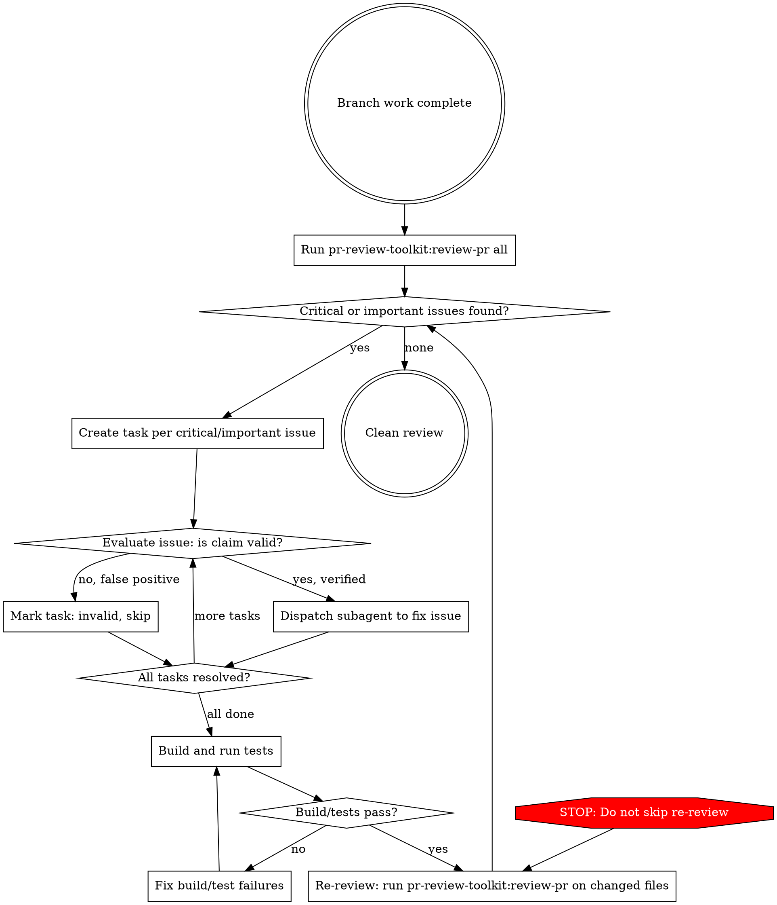

# Iterative Review and Fix

## Overview

Automated review-evaluate-fix loop that uses specialized review agents, critically evaluates each finding, fixes only valid issues, and re-reviews until clean.

**Core principle:** Review with tools, evaluate with skepticism, fix with subagents, verify with re-review. Never stop until the review is clean.

## When to Use

- Branch work is complete and you want automated quality assurance before commit/PR
- After implementing a feature, before creating a PR
- When you want a thorough review without manual back-and-forth

## When NOT to Use

- Mid-implementation (finish the feature first)
- For a single file change (manual review is faster)
- When the user wants to review findings themselves before fixing

## The Loop



## Step-by-Step

### 1. Run Comprehensive Review

Invoke `pr-review-toolkit:review-pr all` using the Skill tool. This launches specialized agents (code-reviewer, silent-failure-hunter, pr-test-analyzer, etc.) that analyze the branch diff.

**Do NOT manually review code instead of using the agents.** The agents provide specialized, thorough analysis that manual reading cannot match.

**ALWAYS use `pr-review-toolkit:review-pr` for ALL reviews in this loop — both initial and re-reviews.** Never substitute `feature-dev:code-reviewer` or any other reviewer agent. The pr-review-toolkit orchestrates multiple specialized agents; a single code-reviewer is not equivalent.

### 2. Filter to Critical and Important Only

From the review summary, extract ONLY items marked **Critical** or **Important**. Ignore suggestions and positive observations - they are not actionable in this loop.

Create a task (TaskCreate) for each critical/important issue with:
- The finding description
- The file and line reference
- The agent that reported it

### 3. Evaluate Each Finding (receiving-code-review Pattern)

For EACH finding, before fixing, apply the receiving-code-review evaluation pattern:

```
READ:     What exactly does the review claim?
VERIFY:   Read the actual code at the referenced location
EVALUATE: Is this claim technically correct for THIS codebase?
DECIDE:   Fix (valid) or Skip (false positive)
```

**Check specifically:**
- Does the issue actually exist in the code? (Read the file)
- Is there existing infrastructure that handles this? (Grep for related patterns)
- Is the reviewer missing context? (Check git blame, related tests, config)
- Would this fix introduce new problems?

Mark invalid findings with reasoning and move on. Do not fix false positives.

**Guard against all-false-positive escape:** If you mark MORE THAN HALF of findings as false positives, pause and re-examine your evaluation criteria. Multiple specialized agents independently flagging the same area is a strong signal. Present your false-positive rationale to the user before proceeding.

**Evaluation depth:** "Read the file" alone is insufficient. You MUST also:
- Grep for related patterns (middleware, validators, base classes that might handle this)
- Check if tests cover the scenario the reviewer flagged
- Read any configuration that affects the behavior

### 4. Fix Valid Issues with Subagents

For each valid finding, dispatch a subagent (Agent tool) with:
- The specific issue to fix
- The file(s) involved
- What the fix should accomplish
- Constraint: build must pass, existing tests must pass

**Use parallel subagents** when fixes are in independent files/domains. Use sequential when fixes overlap.

### 5. Build and Test

After all fixes are applied:
```bash
dotnet build
dotnet test
```

If build or tests fail, fix immediately before proceeding. Never skip to re-review with a broken build.

### 6. Re-Review (MANDATORY)

**This step is NOT optional.** After fixes, invoke `pr-review-toolkit:review-pr` again via the Skill tool, focused on the files that changed during fixes.

**Use the SAME reviewer as Step 1:** `pr-review-toolkit:review-pr`. Do NOT substitute `feature-dev:code-reviewer` or launch individual review agents directly. The pr-review-toolkit provides multi-agent coverage; switching to a single-agent reviewer on re-review defeats the purpose.

This catches:
- Issues introduced by the fixes themselves
- Issues that were masked by the original problems
- Incomplete fixes

### 7. Loop Until Clean

If the re-review finds new critical/important issues, go back to Step 2. There is no maximum iteration count - continue until the review comes back clean.

**If the same issue keeps recurring after 3 iterations:** Stop and ask the user. The fix approach may be fundamentally wrong.

## Red Flags - You Are About to Violate the Process

| Thought | Reality |
|---------|---------|
| "I'll just read the code myself instead of running agents" | Agents provide specialized analysis. Use them. |
| "This finding is obviously correct, skip evaluation" | Obvious findings are often false positives. Always verify. |
| "One pass should be sufficient" | Fixes introduce new issues. Always re-review. |
| "I'll skip re-review since the fixes were small" | Small fixes can have big side effects. Re-review. |
| "The build passes so the fixes are fine" | Building != correct. Review catches logic errors. |
| "I'll fix the suggestions too while I'm at it" | Scope creep. Only critical and important. |
| "I can fix all these manually, no need for subagents" | Subagents provide isolation and focus. Use them for non-trivial fixes. |
| "All of these are false positives" | If >50% are false positives, re-examine your evaluation. Multiple agents flagging the same area is a strong signal. |
| "I'll evaluate by just reading the file" | Reading alone is insufficient. Grep for handlers, check tests, read config. |
| "I'll use feature-dev:code-reviewer for the re-review" | Wrong reviewer. Always use pr-review-toolkit:review-pr — it runs multiple specialized agents, not just one. |

## Common Mistakes

| Mistake | Fix |
|---------|-----|
| Manual review instead of agents | Always invoke pr-review-toolkit:review-pr via Skill tool |
| Using feature-dev:code-reviewer for re-reviews | Always use pr-review-toolkit:review-pr for ALL reviews in this loop |
| Blindly fixing all findings | Evaluate each with receiving-code-review pattern first |
| Skipping re-review after fixes | Re-review is mandatory, not optional |
| Stopping after one iteration | Loop until zero critical/important findings |
| Fixing suggestions alongside critical issues | Only fix critical and important in this loop |
| Not creating tasks for tracking | Create a task per finding for progress tracking |